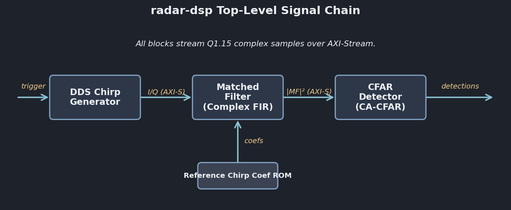
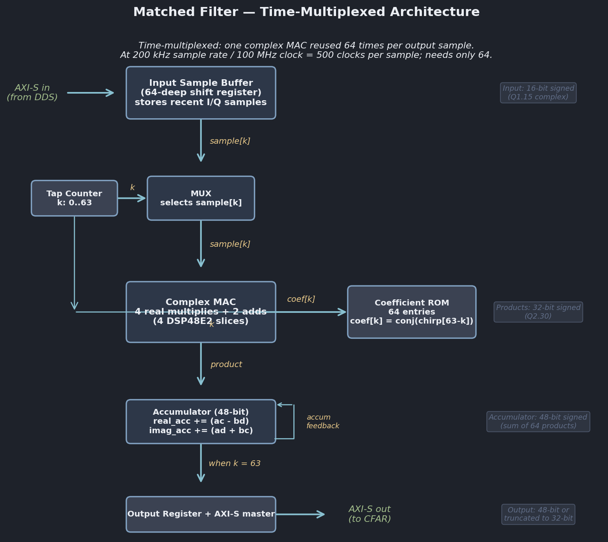
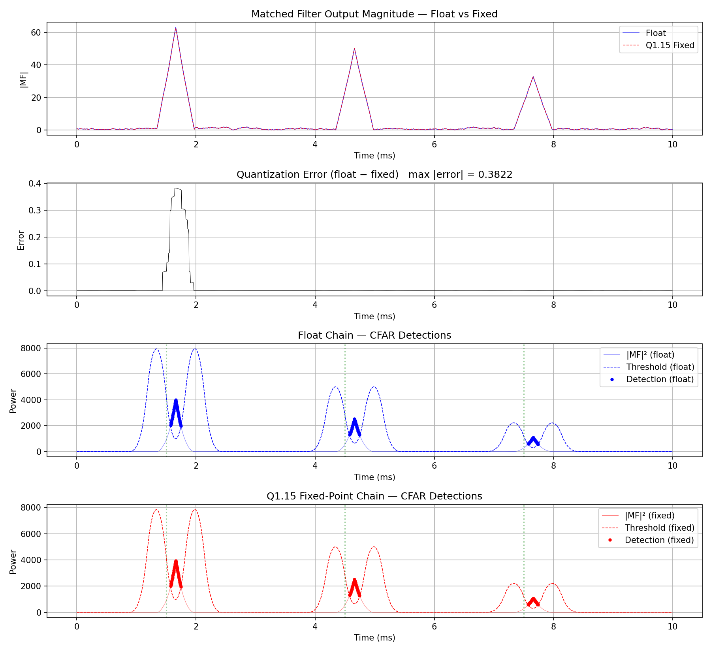

# Pulse Compression Radar DSP

Time-domain pulse compression radar signal chain implemented in VHDL, verified bit-exact against a Python golden reference, targeting deployment on a Zynq UltraScale+ (ZU3) FPGA. Demonstrates radar DSP fundamentals, fixed-point arithmetic, streaming pipeline design, and the full software-to-hardware verification workflow used in defense FPGA development.

**No FFT.** Everything is time-domain: DDS chirp generation, FIR matched filtering, sliding-window CFAR detection.

## Architecture



Three streaming blocks connected via AXI-Stream, all operating on 16-bit signed complex samples (Q1.15 format):

1. **DDS Chirp Generator** — CORDIC/LUT-based direct digital synthesizer that produces a linear FM chirp waveform with configurable start/end frequency and pulse length.
2. **Matched Filter** — Complex FIR filter whose coefficients are the time-reversed, complex-conjugated reference chirp. Compresses the received echo into a sharp peak for range detection.
3. **CA-CFAR Detector** — Cell-Averaging Constant False Alarm Rate detector with adaptive thresholding. Estimates the local noise floor from surrounding training cells and flags targets that exceed it.

## Project Status

| Phase | Description | Status |
|-------|-------------|--------|
| 0 | Repo setup | Done |
| 1 | Python golden reference (float + Q1.15 fixed-point) | Done |
| 2 | DDS chirp generator in VHDL | Done |
| 3 | Matched filter in VHDL | Done |
| 4 | CFAR detector in VHDL | Done |
| 5 | Top-level integration (loopback) | Done |
| 6 | FPGA bring-up on ZU3 | Planned |
| 7 | Hardware demo with ultrasonic transducers | Planned |

## Verification

Every VHDL block is verified bit-exact against the Python reference. The workflow:

1. Python generates the golden output for a given set of parameters
2. VHDL testbench runs the same scenario and dumps output to CSV
3. A comparison script checks every sample, sample-by-sample

First mismatch = fail. This is the same differential testing methodology used in production defense FPGA verification.

### DDS Chirp Generator — Verified

```
VHDL samples:   64
Python samples: 64

PASS: All samples match bit-exact.

First 8 samples:
    n    VHDL_I     Ref_I    VHDL_Q     Ref_Q
    0     32767     32767         0         0
    1     11228     11228     30784     30784
    2    -25202    -25202     20943     20943
    3    -28209    -28209    -16673    -16673
    4      6195      6195    -32177    -32177
    5     32413     32413     -4808     -4808
    6     15447     15447     28899     28899
    7    -22154    -22154     24144     24144
```

### Matched Filter — Verified



Time-multiplexed complex FIR with 64 taps, 4 DSP48E2 slices reused across all taps. 300-sample test with two chirp echoes embedded in noise:

```
VHDL samples:     300
Expected samples: 300

PASS: All samples match bit-exact.

First 8 samples:
    n        VHDL_I         Ref_I        VHDL_Q         Ref_Q
    0            61            61          1117          1117
    1          -561          -561           818           818
    2         -2050         -2050          -607          -607
    3         -1852         -1852         -1738         -1738
    4          1389          1389         -2401         -2401
    5          2851          2851           394           394
    6         -1914         -1914          2647          2647
    7         -3422         -3422           -19           -19

VHDL peak at index:     143
Expected peak at index: 143
```

### CFAR Detector — Verified

CA-CFAR with a 193-sample sliding window (64 training + 32 guard per side + CUT) using O(1) running sum updates. Q16.16 alpha threshold with the training-cell divide pre-baked into the constant. 1000-sample test with three chirp echoes:

```
VHDL samples:     1004
Expected samples: 1000

VHDL detections:     99
Expected detections: 99

PASS: All flags match bit-exact.
```

### Float vs Fixed-Point Comparison



Q1.15 fixed-point preserves detection performance with < 1% relative error at the matched filter peak.

## Design Parameters

| Parameter | Value | Notes |
|-----------|-------|-------|
| Sample rate | 200 kHz | ~5x oversampling of 40 kHz ultrasonic carrier |
| Chirp length | 64 samples | Configurable via VHDL generic |
| Chirp bandwidth | 2 kHz (39-41 kHz) | Configurable |
| Sample format | Q1.15 (16-bit signed) | Matches DSP48E2 native input width |
| Phase accumulator | 24-bit unsigned | 0.012 Hz frequency resolution |
| Sin/cos LUT | 1024 entries | 10-bit phase resolution |
| Inter-block interface | AXI-Stream | tvalid/tready/tlast handshake |

## Repository Structure

```
radar-dsp/
├── python/                  # Golden reference (float + fixed-point)
│   ├── chirp.py             # LFM chirp generator
│   ├── matched_filter.py    # Float and Q1.15 matched filter
│   ├── cfar.py              # CA-CFAR detector
│   ├── fixed_point.py       # Q1.15 arithmetic helpers
│   └── end_to_end.py        # Full chain simulation
├── java/                    # Java reference with explicit bit widths
│   ├── Q15.java             # Q1.15 fixed-point helpers
│   ├── Chirp.java           # Chirp generation
│   ├── MatchedFilter.java   # Float and fixed-point matched filter
│   ├── Cfar.java            # CA-CFAR detector
│   └── PulseCompression.java # End-to-end driver
├── rtl/
│   └── common/
│       ├── chirp.vhd        # DDS chirp generator
│       ├── sin_lut_pkg.vhd  # 1024-entry Q1.15 sine LUT (auto-generated)
│       └── chirp_tb.vhd     # Testbench with CSV file output
├── scripts/
│   ├── generate_sin_lut.py  # Generates sin_lut_pkg.vhd
│   └── compare_chirp.py     # Bit-exact VHDL vs Python comparison
├── sim/vectors/             # Captured reference vectors (.npy)
├── docs/
│   ├── architecture/        # Block diagrams and state machines
│   ├── float_reference.png  # Float chain results
│   └── float_vs_fixed.png   # Quantization error analysis
├── fpga/                    # Constraints and build scripts (upcoming)
└── hardware/                # Ultrasonic demo hardware docs (upcoming)
```

## Tools

- **VHDL simulation:** GHDL + GTKWave
- **Synthesis:** Vivado (targeting Zynq UltraScale+ ZU3)
- **Python:** NumPy, Matplotlib
- **IDE:** VS Code + TerosHDL

## Hardware Demo (Planned)

The signal processing chain will be demonstrated with real ultrasonic echoes using:
- 40 kHz ultrasonic transducer pair (TCT40-16R/T)
- Digilent Pmod AD1 (12-bit ADC, 1 MSPS)
- Digilent Pmod DA2 (12-bit DAC)
- LM386 receive amplifier

The pulse compression algorithm is frequency-agnostic — the same matched filter and CFAR that work at 40 kHz ultrasonic work identically at 24 GHz RF. The DSP chain on the FPGA does not change.
